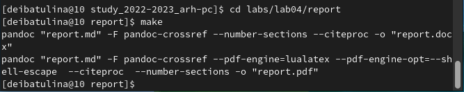

---
## Front matter
title: "Отчёт по лабораторной работе №4: Язык разметки Markdown"
subtitle: "дисциплина: Архитектура компьютера"
author: "Ибатулина Дарья Эдуардовна"

## Generic otions
lang: ru-RU
toc-title: "Содержание"

## Bibliography
bibliography: bib/cite.bib
csl: pandoc/csl/gost-r-7-0-5-2008-numeric.csl

## Pdf output format
toc: true # Table of contents
toc-depth: 2
lof: true # List of figures
lot: true # List of tables
fontsize: 12pt
linestretch: 1.5
papersize: a4
documentclass: scrreprt
## I18n polyglossia
polyglossia-lang:
  name: russian
  options:
	- spelling=modern
	- babelshorthands=true
polyglossia-otherlangs:
  name: english
## I18n babel
babel-lang: russian
babel-otherlangs: english
## Fonts
mainfont: PT Serif
romanfont: PT Serif
sansfont: PT Sans
monofont: PT Mono
mainfontoptions: Ligatures=TeX
romanfontoptions: Ligatures=TeX
sansfontoptions: Ligatures=TeX,Scale=MatchLowercase
monofontoptions: Scale=MatchLowercase,Scale=0.9
## Biblatex
biblatex: true
biblio-style: "gost-numeric"
biblatexoptions:
  - parentracker=true
  - backend=biber
  - hyperref=auto
  - language=auto
  - autolang=other*
  - citestyle=gost-numeric
## Pandoc-crossref LaTeX customization
figureTitle: "Рис."
tableTitle: "Таблица"
listingTitle: "Листинг"
lofTitle: "Список иллюстраций"
lotTitle: "Список таблиц"
lolTitle: "Листинги"
## Misc options
indent: true
header-includes:
  - \usepackage{indentfirst}
  - \usepackage{float} # keep figures where there are in the text
  - \floatplacement{figure}{H} # keep figures where there are in the text
---

# Цель работы

  Целью работы является освоение процедуры оформления отчетов с помощью легковесного языка разметки Markdown.

# Задание

1. Ознакомиться с синтаксисом языка разметки Markdown (оформление списков, заголовков и их уровней, курсивного и жирного выделения текста, изображений и гиперссылок, компиляция файлов);
2. Установить texlive, pandoc, pandoc-crossref для обработки документов в формате .md;
3. Скачать изменения из удалённого репозитория;
4. Открыть и отредактировать отчёты по лабораторным работам №3 и №4 в формате .md (на языке разметки Markdown);
5. Скомпилировать отчёты по данным работам в форматы .docx и .pdf;
6. Загрузить изменённые файлы на GitHub.

# Теоретическое введение

  Для создания заголовков необходимо использовать следующий шаблон:
  # + имя заголовка
  Чтобы создать заголовки разных уровней, нужно поставить количество символов # в соответствии с уровнем заголовка. Например:
  # This is heading 1
  ## This is heading 2
  ### This is heading 3
  #### This is heading 4

  Задание полужирного начертания осуществляется путём заключения исходного текста в двойные звёздочки:
  
  **This text is bold**

  Выделение курсивом осуществляется путём заключения исходного текста в одинарные звёздочки:
  
  *This text is italic*
  
  Соответственно, для применения и полужирного, и курсивного стилей начертания нужно заключить текст в тройные звёздочки:
  
  ***This text is bold and italic at the same time***
  
  Блоки цитирования создаются с помощью символа >:
  
  > The pain of studying is only temporary. But the pain of not knowing - ignorance - is forever.
  
  Упорядоченный список можно отформатировать с помощью соответствующих цифр (номер пункта.пробел Название пункта Enter):

  1. Success doesn't come to you, you go for it;
  2. When you think it's too late, the truth is, it's still early;
  3. If you don't walk today, you'll have to run tomorrow.
  
  Неупорядоченный (маркированный) список можно отформатировать с помощью звездочек или тире:
  
  # Advantages of using Markdown when compiling reports to the laboratory works:
  * Quickness;
  * Cosiness;
  * Developing creative and analytical thinking.
  
  Синтаксис Markdown для встроенной ссылки состоит из части [link text] - оформляется в квадратных скобках, представляющей текст гиперссылки, и части (file-name.md) - оформляется в круглых скобках – URL-адреса или имени файла, на который дается ссылка:
  [система контроля версий Git](https://github.com)
  
  Markdown поддерживает как встраивание фрагментов кода в предложение, так и их размещение между предложениями в виде отдельных огражденных блоков. Огражденные блоки кода — это простой способ выделить синтаксис для фрагментов кода. Общий формат огражденных блоков кода - его выделение ''' с двух сторон:
``` language
your code goes in here
```
  
# Выполнение лабораторной работы

 Для начала необходимо перейти в терминал и установить texlive, pandoc и pandoc-crossref.  (рис. [-@fig:fig1], [-@fig:fig2], [-@fig:fig3], [-@fig:fig4], [-@fig:fig5], [-@fig:fig6], [-@fig:fig7], [-@fig:fig8], [-@fig:fig9], [-@fig:fig10])
 
{ #fig:fig1 width=70% }

{ #fig:fig2 width=70% }

{ #fig:fig3 width=70% }

{ #fig:fig4 width=70% }

{ #fig:fig5 width=70% }

{ #fig:fig6 width=70% }

{ #fig:fig7 width=70% }

{ #fig:fig8 width=70% }

{ #fig:fig9 width=70% }

{ #fig:fig10 width=70% }

  Скачиваем изменения из удалённого репозитория с помощью команды git pull.  (рис. [-@fig:fig11], [-@fig:fig12])
  
{ #fig:fig11 width=70% }
  
{ #fig:fig12 width=70% }
  
  Переходим в подкаталог labs/lab04/report и компилируем шаблоны отчётов в форматы .docx и .pdf (рис. [-@fig:fig13]). Затем проверяем корректность выполненных действий  (рис. [-@fig:fig14]), удаляем скомпилированные файлы и вновь проверяем корректность выполненных действий.  (рис. [-@fig:fig15])
  
{ #fig:fig13 width=70% }

{ #fig:fig14 width=70% }

{ #fig:fig15 width=70% }

  Начинаем редактирование отчёта по лабораторной работе №3, перейдя в соответствующий подкаталог labs/lab03/report. С помощью текстового процессора gedit редактируем отчёт.  (рис. [-@fig:fig16])
  
{ #fig:fig16 width=70% }

  После установки открывается окно с шаблоном. Начинаем изменять его, вводя свои данные.  (рис. [-@fig:fig17], [-@fig:fig18], [-@fig:fig19], [-@fig:fig20], [-@fig:fig21])
  
{ #fig:fig17 width=70% }

{ #fig:fig18 width=70% }

{ #fig:fig19 width=70% }

{ #fig:fig20 width=70% }

{ #fig:fig21 width=70% }
 
  Компилируем отчёт в двух форматах: .docx и .pdf.  (рис. [-@fig:fig22])
  
{ #fig:fig22 width=70% }

# Выводы

  Я научилась создавать и обрабатывать отчёты с помощью языка разметки Markdown.

# Список литературы{.unnumbered}
  1.  Руководство по выполнению лабораторной работы №4.

::: {#refs}
:::
