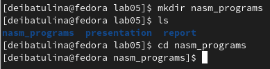

---
## Front matter
title: "Отчёт по лабораторной работе №5. Создание и процесс обработки программ на языке ассемблера NASM"
subtitle: "дисциплина: Архитектура компьютера"
author: "Ибатулина Дарья Эдуардовна"

## Generic otions
lang: ru-RU
toc-title: "Содержание"

## Bibliography
bibliography: bib/cite.bib
csl: pandoc/csl/gost-r-7-0-5-2008-numeric.csl

## Pdf output format
toc: true # Table of contents
toc-depth: 2
lof: true # List of figures
lot: true # List of tables
fontsize: 12pt
linestretch: 1.5
papersize: a4
documentclass: scrreprt
## I18n polyglossia
polyglossia-lang:
  name: russian
  options:
	- spelling=modern
	- babelshorthands=true
polyglossia-otherlangs:
  name: english
## I18n babel
babel-lang: russian
babel-otherlangs: english
## Fonts
mainfont: PT Serif
romanfont: PT Serif
sansfont: PT Sans
monofont: PT Mono
mainfontoptions: Ligatures=TeX
romanfontoptions: Ligatures=TeX
sansfontoptions: Ligatures=TeX,Scale=MatchLowercase
monofontoptions: Scale=MatchLowercase,Scale=0.9
## Biblatex
biblatex: true
biblio-style: "gost-numeric"
biblatexoptions:
  - parentracker=true
  - backend=biber
  - hyperref=auto
  - language=auto
  - autolang=other*
  - citestyle=gost-numeric
## Pandoc-crossref LaTeX customization
figureTitle: "Рис."
tableTitle: "Таблица"
listingTitle: "Листинг"
lofTitle: "Список иллюстраций"
lotTitle: "Список таблиц"
lolTitle: "Листинги"
## Misc options
indent: true
header-includes:
  - \usepackage{indentfirst}
  - \usepackage{float} # keep figures where there are in the text
  - \floatplacement{figure}{H} # keep figures where there are in the text
---

# Цель работы

  Освоение процедуры компиляции и сборки программ, написанных на ассемблере NASM.

# Задание

  1. Ознакомиться с теоретическим введением к работе;
  2. Создать каталог для программ на языке ассемблера;
  3. Написать простейшую программу, выводящую на экран "Hello, world!"!;
  4. Выполнить компоновку объектного файла, запустить исполняемый файл; 
  5. Загрузить полученные файлы на Github;
  6. Сделать вывод по лабораторной работе;
  7. Оформить отчёт в Markdown.
  

# Теоретическое введение

  Основными функциональными элементами любой ЭВМ являются память, процессор и периферийные устройства. Через общую шину они взаимодействуют друг с другом. Физически шина представляет собой большое количество проводников, соединяющих устройства друг с другом. В современных компьютерах проводники выполнены в виде электропроводящих дорожек на материнской (системной) плате.

  Задачи процессора - обработка информации и координация работы всех узлов компьютера. В состав центрального процессора входят:
  
   * арифметико-логическое устройство (АЛУ);
   * устройство управления (УУ);
   * регистры.
   
   Для того, чтобы писать программы на ассемблере, необходимо знать, какие регистры процессора существуют и как их можно использовать. Большинство команд в программах написанных на ассемблере используют регистры в качестве операндов. Практически все команды представляют собой преобразование данных, хранящихся в регистрах процессора, это например пересылка данных между регистрами или между регистрами и памятью, преобразование (арифметические или логические операции) данных хранящихся в регистрах.

  Доступ к регистрам осуществляется не по адресам, как к основной памяти, а по именам. Каждый регистр процессора архитектуры x86 имеет свое название, состоящее из 2 или 3 букв латинского алфавита. К примеру, RAX - 64-битные, EAX - 32-битные.
  
  Таким образом можно отметить, что вы можете написать в своей программе, например, такие команды (mov – команда пересылки данных на языке ассемблера):

mov ax, 1
mov eax, 1

  Обе команды поместят в регистр AX число 1. Разница будет заключаться только в том, что вторая команда обнулит старшие разряды регистра EAX, то есть после выполнения второй команды в регистре EAX будет число 1. А первая команда оставит в старших разрядах регистра EAX старые данные. И если там были данные, отличные от нуля, то после выполнения первой команды в регистре EAX будет какое-то число, но не 1. А вот в регистре AX будет число 1.

  Другим важным узлом ЭВМ является оперативное запоминающее устройство (ОЗУ). ОЗУ — это быстродействующее энергозависимое запоминающее устройство, которое напрямую взаимодействует с узлами процессора, предназначенное для хранения программ и данных, с которыми процессор непосредственно работает в текущий момент. ОЗУ состоит из одинаковых пронумерованных ячеек памяти. Номер ячейки памяти — это адрес хранящихся в ней данных.
  
  В состав ЭВМ также входят периферийные устройства, которые можно разделить на:
  - устройства внешней памяти, которые предназначены для долговременного хранения больших объёмов данных (жёсткие диски, твердотельные накопители, магнитные ленты);
  - устройства ввода-вывода, которые обеспечивают взаимодействие ЦП с внешней средой.
  
  В основе вычислительного процесса лежит **принцип программного управления**. Это значит, что компьютер выполняет алгоритм (последовательность команд). Коды команд состоят из нулей и единиц. 
  При выполнении каждой команды процессор выполняет определённую последовательность стандартных действий, которая называется **командным циклом процессора**. В самом общем виде он заключается в следующем:
  
  1. формирование адреса в памяти очередной команды;
  2. считывание кода команды из памяти и её дешифрация;
  3. выполнение команды;
  4. переход к следующей команде.
  
  Данный алгоритм позволяет выполнить хранящуюся в ОЗУ программу.
  
  Язык ассемблера — это язык, с помощью которого понятным для человека образом пишутся команды для процессора. В современных компьютерах пользователь не получает прямого доступа к процессору, обращение происходит к ядру.
  
  Следует отметить, что процессор понимает не команды ассемблера, а последовательности из нулей и единиц — машинные коды. До появления языков ассемблера программистам приходилось писать программы, используя только
лишь машинные коды, которые были крайне сложны для запоминания, так как представляли собой числа, записанные в двоичной или шестнадцатеричной системе счисления. Преобразование или трансляция команд с языка ассемблера в исполняемый машинный код осуществляется специальной программой транслятором — Ассемблер.

  NASM — это открытый проект ассемблера, версии которого доступны под различные операционные системы и который позволяет получать объектные файлы для этих систем. В NASM используется Intel-синтаксис и поддерживаются инструкции x86-64.

  Типичный формат записи команд NASM имеет вид:
  
  [метка:] мнемокод [операнд {, операнд}] [; комментарий]
  
  Здесь ***мнемокод*** — непосредственно мнемоника инструкции процессору, которая является обязательной частью команды. Операндами могут быть числа, данные, адреса регистров или адреса оперативной памяти. ***Метка*** — это идентификатор, с которым ассемблер ассоциирует некоторое число, чаще всего адрес в памяти. Т.о. метка перед командой связана с адресом данной команды.

  Допустимыми символами в метках являются буквы, цифры, а также следующие символы: _, $, #, @,~,. и ?.
Начинаться метка или идентификатор могут с буквы, ., _ и ?. Перед идентификаторами, которые пишутся как *зарезервированные слова*, нужно писать $, чтобы компилятор трактовал его верно (так называемое экранирование). Максимальная длина идентификатора 4095 символов.

  Программа на языке ассемблера также может содержать ***директивы*** — инструкции, не переводящиеся непосредственно в машинные команды, а управляющие работой транслятора. Например, директивы используются для определения данных (констант и переменных) и обычно пишутся большими буквами.
  
  Программа на языке Ассемблера состоит из следующих уровней:
  
  * текст программы;
  * трансляция;
  * компоновка (линковка);
  * запуск программы.

# Выполнение лабораторной работы

  Создаём каталог для разработки программ на языке ассемблера Nasm и переходим в него. (рис. [-@fig:001])

{ #fig:001 width=70% }

  Создаём текстовый файл с помощью команды *touch* и открываем его в текстовом редакторе gedit, вносим изменения в текст программы, сохраняем (рис. [-@fig:002]), (рис. [-@fig:003]).
  
{ #fig:002 width=70% }

{ #fig:003 width=70% }
  
  Компилируем данный текст программы, проверяем корректность выполненных действий (рис. [-@fig:004]).
  
{ #fig:004 width=70% }

  Выполняем следующую команду (рис. [-@fig:005]):
  
{ #fig:005 width=70% }
  
  Данная команда скомпилирует исходный файл hello.asm в obj.o (опция -o позволяет задать имя объектного файла, в данном случае obj.o), при этом формат выходного файла будет elf, и в него будут включены символы для отладки (опция -g), кроме того, будет создан файл листинга list.lst (опция -l).

  Проверяем корректность выполненных действий (рис. [-@fig:006]).
  
{ #fig:006 width=70% }

  Передаём объектный файл на обработку компоновщику, проверяем корректность выполненных действий (рис. [-@fig:007]).
  
{ #fig:007 width=70% }

  Задаём имя исполняемого файла (рис. [-@fig:008]). Имя исполняемого файла - main, объектный файл, из которого он собран, имеет имя obj.o.
  
{ #fig:008 width=70% }

  Запускаем программу (рис. [-@fig:009]).
  
{ #fig:009 width=70% }

  Переходим к выполнению заданий для самостоятельной работы. Первым делом создаём копию файла hello.asm, созданного при выполнении лабораторной работы, в папке для разработки программ (рис. [-@fig:010]).
  
{ #fig:010 width=70% }

  Далее редактируем данный файл с помощью текстового редактора gedit (рис. [-@fig:011]), (рис. [-@fig:012]).
  
{ #fig:011 width=70% }

{ #fig:012 width=70% }

  Компонуем и запускаем исполняемый файл (рис. [-@fig:013]).
  
{ #fig:013 width=70% }

  Копируем 2 файла с программами в каталог для лабораторных работ (рис. [-@fig:014]).
  
{ #fig:014 width=70% }

  Проверяем корректность выполненных действий (рис. [-@fig:015]).
  
{ #fig:015 width=70% }

  Отправляем файлов на GitHub посредством локального репозитория (рис. [-@fig:016]).
  
{ #fig:016 width=70% }

# Выводы

  В ходе выполнения лабораторной работы я освоила процедуру компиляции и сборки программ, написанных на      низкоуровневом языке программирования Ассемблер.

# Список литературы{.unnumbered}

* Руководство к лабораторной работе №5. Создание и процесс обработки программ на языке ассемблера NASM.

::: {#refs}
:::
