---
## Front matter
title: "Отчёт по лабораторной работе №6. Основы работы с Midnight Commander (mc). Структура программы на языке ассемблера NASM. Системные вызовы в ОС GNU Linux"
subtitle: "дисциплина: Архитектура компьютера"
author: "Ибатулина Дарья Эдуардовна"

## Generic otions
lang: ru-RU
toc-title: "Содержание"

## Bibliography
bibliography: bib/cite.bib
csl: pandoc/csl/gost-r-7-0-5-2008-numeric.csl

## Pdf output format
toc: true # Table of contents
toc-depth: 2
lof: true # List of figures
lot: true # List of tables
fontsize: 12pt
linestretch: 1.5
papersize: a4
documentclass: scrreprt
## I18n polyglossia
polyglossia-lang:
  name: russian
  options:
	- spelling=modern
	- babelshorthands=true
polyglossia-otherlangs:
  name: english
## I18n babel
babel-lang: russian
babel-otherlangs: english
## Fonts
mainfont: PT Serif
romanfont: PT Serif
sansfont: PT Sans
monofont: PT Mono
mainfontoptions: Ligatures=TeX
romanfontoptions: Ligatures=TeX
sansfontoptions: Ligatures=TeX,Scale=MatchLowercase
monofontoptions: Scale=MatchLowercase,Scale=0.9
## Biblatex
biblatex: true
biblio-style: "gost-numeric"
biblatexoptions:
  - parentracker=true
  - backend=biber
  - hyperref=auto
  - language=auto
  - autolang=other*
  - citestyle=gost-numeric
## Pandoc-crossref LaTeX customization
figureTitle: "Рис."
tableTitle: "Таблица"
listingTitle: "Листинг"
lofTitle: "Список иллюстраций"
lotTitle: "Список таблиц"
lolTitle: "Листинги"
## Misc options
indent: true
header-includes:
  - \usepackage{indentfirst}
  - \usepackage{float} # keep figures where there are in the text
  - \floatplacement{figure}{H} # keep figures where there are in the text
---

# Цель работы

  Приобретение практических навыков работы в Midnight Commander. Освоение инструкций языка ассемблера mov и int.

# Задание

  1. Создать каталог для программ на языке Ассемблера для лабораторной работы №6;
  2. Создать в данном каталоге текстовый файл, ввести текст программы в соответствии с указаниями к лабораторной работе;
  3. Оттранслировать его в объектный файл и проверить работу файла;
  4. Создать копию вышеупомянутого файла;
  5. Скачать из ТУИСа внешний файл с программой, переместить его в каталог для программ по лабораторной работе №6;
  6. Ввести в новый созданный файл текст программы в соответствии с указаниями к лабораторной работе, подключив внешний файл, исправив предыдущий текст;
  7. Оттранслировать его в объектный файл, затем в исполняемый файл и проверить его работу;
  8. Создать ещё одну копию первого файла с программой;
  9. Внести изменения в текст программы в соответствии с указаниями, не используя внешний файл;
  10. Создать исполняемый файл и проверить его работу;
  11. Создать ещё одну копию второго файла с программой;
  12. Внести изменения в текст программы в соответствии с указаниями, используя внешний файл;
  13. Создать исполняемый файл и проверить его работу.

# Теоретическое введение

## Основы работы с Midnight Commander
  Midnight Commander (или просто mc) — это программа, которая позволяет просматривать структуру каталогов и выполнять основные операции по управлению файловой системой, т.е. mc является файловым менеджером. Midnight
Commander позволяет сделать работу с файлами более удобной и наглядной.
  Для того, чтобы начать работу с программой, необходимо написать в терминале команду mc и нажать Ener.

Например, в табл. [-@tbl:std-dir] приведены функциональные клавиши mc и их использование.

: Функциональные клавиши Midnight Commander {#tbl:std-dir}

| Клавиша      | Назначение                                                                                |
|--------------|----------------------------------------------------------------------------------------------------------------------------|
| `f1`         | вызов контекстно-зависимой подсказки                                                      | 
| `f2`         | вызов меню, созданного пользователем                                                      |
| `f3`         | просмотр файла, на который указывает подсветка в активной панели                          |
| `f4`         | вызов встроенного редактора для файла, на который указывает подсветка в активной панели   |
| `f5`         | копирование файла или группы отмеченных файлов из каталога, отображаемого в активной панели, в каталог, отображаемый на второй панели                                                           |
| `f6`         | перенос файла или группы отмеченных файлов из каталога, отображаемого в активной панели, в каталог, отображаемый на второй панели                                                                     | 
| `f7`         | создание подкаталога в каталоге, отображаемом в активной панели                           |
| `f8`         | удаление файла (подкаталога) или группы отмеченных файлов                                 |
| `f9`         | вызов основного меню программы                                                            |
| `f10`        | выход из программы                                                                        |

##  Структура программы на языке ассемблера NASM

  Программа на языке ассемблера NASM, как правило, состоит из трёх секций: секция кода программы (SECTION .text), секция инициированных (известных во время компиляции) данных (SECTION .data) и секция неинициализированных данных (тех, под которые во время компиляции только отводится память, а значение присваивается в ходе выполнения программы) (SECTION .bss).
  
  Таким образом, общая структура программы имеет следующий вид:
  
``` assembler
  SECTION .data; Секция содержит переменные, для
  ...          ; которых задано начальное значение
  SECTION .bss ; Секция содержит переменные, для
  ...          ; которых не задано начальное значение
  SECTION .text; Секция содержит код программы
    GLOBAL _start
    _start:    ; Точка входа в программу
    ...        ; Текст программы
    mov eax,1  ; Системный вызов для выхода (sys_exit)
    mov ebx,0  ; Выход с кодом возврата 0 (без ошибок)
    int 80h    ; Вызов ядра

```

  Для объявления инициированных данных в секции .data используются директивы DB, DW, DD, DQ и DT, которые резервируют память и указывают, какие значения должны храниться в этой памяти:
  
* DB (define byte) — определяет переменную размером в 1 байт;
* DW (define word) — определяет переменную размеров в 2 байта (слово);
* DD (define double word) — определяет переменную размером в 4 байта
(двойное слово);
* DQ (define quad word) — определяет переменную размером в 8 байт (учетверённое слово);
* DT (define ten bytes) — определяет переменную размером в 10 байт.

## Элементы программирования

### Описание инструкции mov

  Инструкция языка ассемблера *mov* предназначена для дублирования данных источника в приёмнике. В общем виде эта инструкция записывается в виде:
  
  'mov dst,src'

  Здесь операнд dst — приёмник, а src — источник. Также необходимо учитывать то, что размер операндов приемника и источника должны совпадать.
  
### Описание инструкции int

  Инструкция языка ассемблера intпредназначена для вызова прерывания с указанным номером. В общем виде она записывается в виде:
  
  'int n'
  
  Здесь n — номер прерывания, принадлежащий диапазону 0–255. При программировании в Linux с использованием вызовов ядра sys_calls n=80h (принято задавать в шестнадцатеричной системе счисления).

### Системные вызовы для обеспечения диалога с пользователем

  Простейший диалог с пользователем требует наличия двух функций — вывода текста на экран и ввода текста с клавиатуры. Простейший способ вывести строку на экран — использовать системный вызов ***write***. Этот системный вызов имеет номер *4*, поэтому перед вызовом инструкции ***int*** необходимо поместить значение *4* в регистр ***eax***. Первым аргументом ***write***, помещаемым в регистр ***ebx***, задаётся дескриптор файла. Для вывода на экран в качестве дескриптора файла нужно указать *1* (это означает «стандартный вывод», т. е. вывод на экран).
  
  Вторым аргументом задаётся адрес выводимой строки (помещаем его в регистр ***ecx***, например, инструкцией 'mov ecx, msg'). Строка может иметь любую длину. Последним аргументом (т.е. в регистре ***edx***) должна задаваться максимальная длина выводимой строки.
  
  Для ввода строки с клавиатуры можно использовать аналогичный системный вызов read. Его аргументы – такие же, как у вызова ***write***, только для «чтения» с клавиатуры используется файловый дескриптор *0* (стандартный ввод).

  Системный вызов ***exit*** является обязательным в конце любой программы на языке ассемблер. Для обозначения конца программы перед вызовом инструкции ***int 80h*** необходимо поместить в регистр **еах*** значение *1*, а в регистр ***ebx*** код завершения *0*.

### Подключение внешнего файла

  Для упрощения написания программ часто встречающиеся одинаковые участки кода (такие как, например, вывод строки на экран или выход их программы) можно оформить в виде подпрограмм и сохранить в отдельные файлы, а во всех нужных местах поставить вызов нужной подпрограммы. Это позволяет сделать основную программу более удобной для написания и чтения.
  
  NASM позволяет подключать внешние файлы с помощью директивы '%include', которая предписывает ассемблеру заменить эту директиву содержимым файла. Подключаемые файлы также написаны на языке ассемблера. Важно отметить, что директива %include в тексте программы должна стоять раньше, чем встречаются вызовы подпрограмм из подключаемого файла. Для вызова подпрограммы из внешнего файла используется инструкция call, которая имеет следующий вид:
  
  'call *function*',
  
  где *function* - имя подпрограммы.

# Выполнение лабораторной работы

  1. Сначала открываем терминал, вводим команду mc и видим открывшееся окно MidnightCommander (рис. [-@fig:001]):

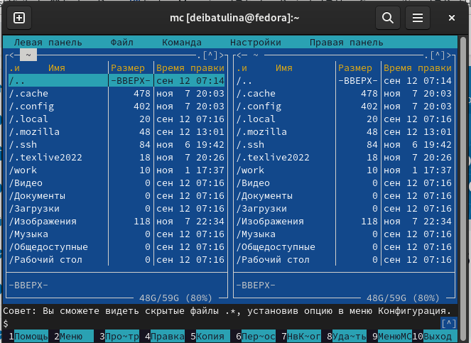{ #fig:001 width=70% }

  2. C помощью функциональной клавиши F7 создаём в каталоге для написания программ на Ассемблере папку для лабораторной работы №6  (рис. [-@fig:002]):
  
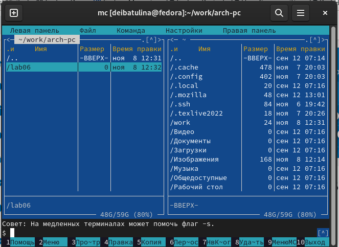{ #fig:002 width=70% }

  3. Пользуясь строкой ввода, создаём файл lab6-1.asm (рис. [-@fig:003]):

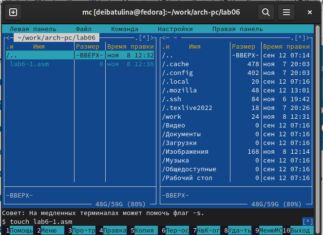{ #fig:003 width=70% }

  4. С помощью клавиши F4 открываем данный файл для редактирования (рис. [-@fig:004]). По умолчанию файл открывается в текстовом редакторе mcedit:
  
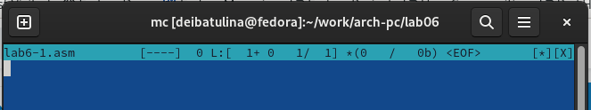{ #fig:004 width=70% }

  5. Вводим в файл текст программы из листинга, как указано в лабораторной работе (рис. [-@fig:005]). Данная программа выводит сообщение на экран, ждёт ввода строки от пользователя:
  
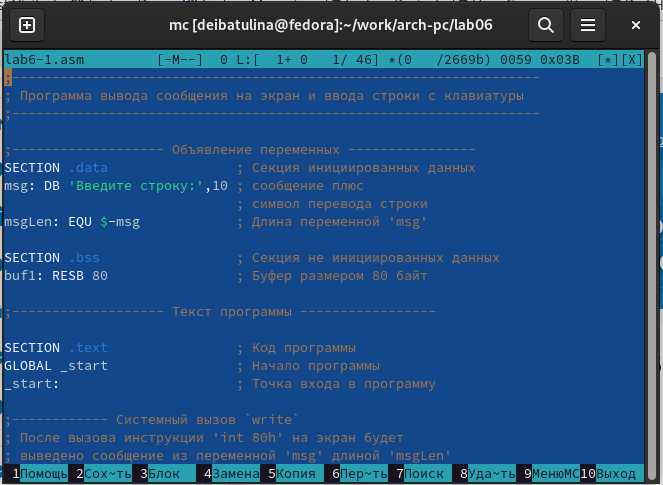{ #fig:005 width=70% }

  6. Сохраняем изменения в файле с помощью клавиши F2 (рис. [-@fig:006]):
  
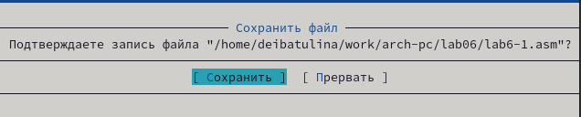{ #fig:006 width=70% }

  7. Открываем файл для просмотра с помощью клавиши F3, убеждаемся в том, что данный файл содержит текст программы (рис. [-@fig:007]):
  
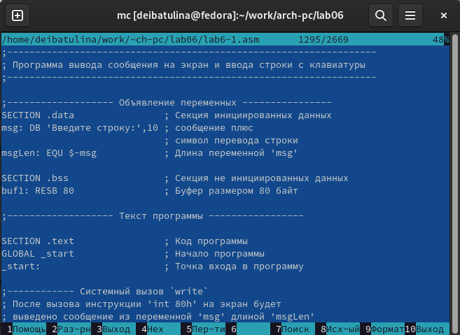{ #fig:007 width=70% }

  8. Транслируем файл в объектный, затем в исполняемый, проверяем корректность работы программы (рис. [-@fig:008]):
  
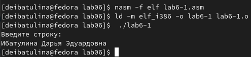{ #fig:008 width=70% }

  Заметим, что программа успешно работает.

  9. Для дальнейшей работы необходимо подключить внешний файл. Программа также должна выводить на экран сообщение и ждать от пользователя ввода строки с клавиатуры. При этом часть инструкций чодержится во внешнем файле. Для этого скачиваем внешний файл со страницы курса в ТУИС  (рис. [-@fig:009]):
  
{ #fig:009 width=70% }

  10. Для работы со внешним файлом он должен лежать в том же каталоге, что и файл с кодом программы. Перемещаем его в каталог lab06, пользуясь функциональной клавишей F5 (рис. [-@fig:010]):
  
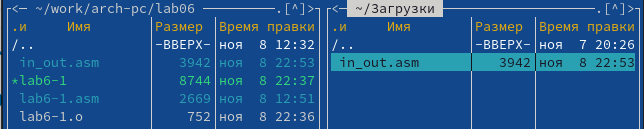{ #fig:010 width=70% }

  11. С помощью клавиши F5 создаём копию файла lsb6-1.asm, называем его lab6-2.asm (рис. [-@fig:011]):
  
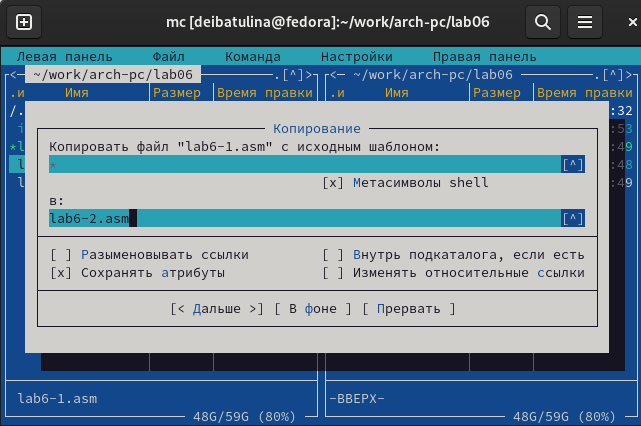{ #fig:011 width=70% }

  12. Далее вводим в этот файл текст программы, указанный в лабораторной работе (рис. [-@fig:012]), создаём исполняемый файл и проверяем его работу (рис. [-@fig:013]):
  
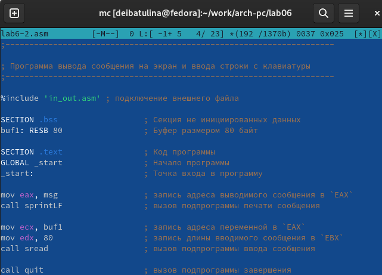{ #fig:012 width=70% }

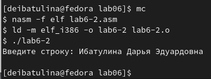{ #fig:013 width=70% }

  13. Вносим изменения в файл lab6-2.asm, заменяя команду 'sprintLF' на 'sprint', создаём исполняемый файл и проверяем его работу (рис. [-@fig:014]):
  
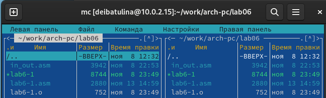{ #fig:014 width=70% }

  Мы видим, что различие есть: оно заключается в том, что в первом случае после ввода строки с клавиатуры пользователем курсор переносился на новую строку, а в исправленном файле - нет. Всё дело в том, что команда 'sprintLF' добавляет к сообщению символ перевода строки. 
  
---

## Выполнение заданий для самостоятельной работы

  1. Напишем программу для того, чтобы она выводила сообщение на экран, требовала от пользователя ввода строки с клавиатуры, а затем выводила эту сроку на экран. Создаём копию файла lab6-1.asm с помощью клавиши F5, называем его lab6-1_copy.asm (рис. [-@fig:015]):
  
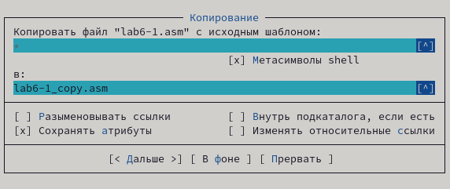{ #fig:015 width=70% }
  
  2. Нажимаем F4, вносим в него текст программы:
  
  **Листинг 1. Программа вывода сообщения на экран, ввода строки с клавиатуры и вывода данной строки на экран**

```assembler
;------------------------------------------------------------------------------------
; Программа вывода сообщения на экран, ввода строки с клавиатуры и её вывода на экран'
;-------------------------------------------------------------------------------------

;------------------- Объявление переменных ----------------
SECTION .data                ; Секция инициированных данных
msg: DB 'Введите строку:',10 ; сообщение плюс
; символ перевода строки

msgLen: EQU $-msg ; Длина переменной 'msg'
SECTION .bss ; Секция не инициированных данных
buf1: RESB 80 ; Буфер размером 80 байт

;------------------- Текст программы -----------------
SECTION .text ; Код программы
GLOBAL _start ; Начало программы
_start: ; Точка входа в программу

;------------ Cистемный вызов `write`
; После вызова инструкции 'int 80h' на экран будет
; выведено сообщение из переменной 'msg' длиной 'msgLen'
mov eax,4 ; Системный вызов для записи (sys_write)
mov ebx,1 ; Описатель файла 1 - стандартный вывод
mov ecx,msg ; Адрес строки 'msg' в 'ecx'
mov edx,msgLen ; Размер строки 'msg' в 'edx'
int 80h ; Вызов ядра

;------------ системный вызов `read` ----------------------
; После вызова инструкции 'int 80h' программа будет ожидать ввода
; строки, которая будет записана в переменную 'buf1' размером 80
байт
mov eax, 3 ; Системный вызов для чтения (sys_read)
mov ebx, 0 ; Дескриптор файла 0 - стандартный ввод
mov ecx, buf1 ; Адрес буфера под вводимую строку
mov edx, 80 ; Длина вводимой строки
int 80h ; Вызов ядра

;------------ Cистемный вызов `write`
; После вызова инструкции 'int 80h' на экран будет
; выведено сообщение из переменной 'msg' длиной 'msgLen'
mov eax,4 ; Системный вызов для записи (sys_write)
mov ebx,1 ; Описатель файла 1 - стандартный вывод
mov ecx,buf1 ; Адрес строки 'buf1' в 'ecx'
mov edx,buf1 ; Размер строки 'buf1' в 'edx'
int 80h ; Вызов ядра

;------------ Системный вызов `exit` ----------------------
; После вызова инструкции 'int 80h' программа завершит работу
mov eax,1 ; Системный вызов для выхода (sys_exit)
mov ebx,0 ; Выход с кодом возврата 0 (без ошибок)
int 80h ; Вызов ядра

```
---

  **!Примечание!** Чтобы вывести введённую пользователем строку на экран, после системного вызова *read* добавляем ещё один блок кода системный вызов *write*, меняем msg и msgLen на buf1, чтобы записать в регистры адрес и размер строки, введённой пользователем с клавиатуры, соответственно.

  3. Создаём исполняемый файл, проверяем работу исполняемого файла (рис. [-@fig:016]):
  
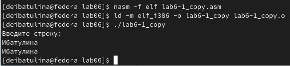{ #fig:016 width=70% }
  
  4. Теперь нужно создать аналогичную программу, но с подключением внешнего файла *in_out.asm*. Создаём копию файла lab6-2.asm с помощью клавиши F5, называем его lab6-2_copy.asm (рис. [-@fig:017]):
  
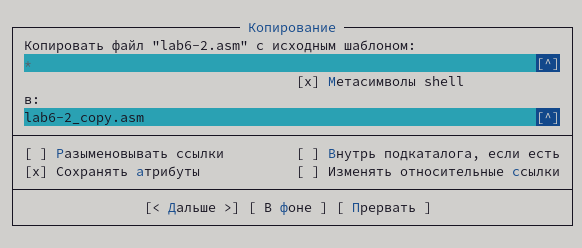{ #fig:017 width=70% }
  
  5. Нажимаем F4, вносим в него текст программы:
  
  **Листинг 2. Программа вывода сообщения на экран, ввода строки с клавиатуры и вывода данной строки на экран (с подключением внешнего файла)**
  
```assembler
;--------------------------------------------------------------------
; Программа вывода сообщения на экран и ввода строки с клавиатуры
;---------------------------------------------------------------------

%include 'in_out.asm' ; подключение внешнего файла

SECTION .data ; Секция инициированных данных
msg: DB 'Введите строку: ',0h ; сообщение
SECTION .bss ; Секция не инициированных данных
buf1: RESB 80 ; Буфер размером 80 байт
SECTION .text ; Код программы
GLOBAL _start ; Начало программы
_start: ; Точка входа в программу
mov eax, msg ; запись адреса выводимого сообщения в `EAX`
call sprint ; вызов подпрограммы печати сообщения
mov ecx, buf1 ; запись адреса переменной в `EAX`
mov edx, 80 ; запись длины вводимого сообщения в `EBX`
call sread ; вызов подпрограммы ввода сообщения
mov eax,4 ; системный вызов для записи (sys_write)
mov ebx,1 ; описатель файла '1' - стандартный вывод
mov ecx,buf1 ; адрес строки buf1 в ecx
int 80h ; вызов ядра
call quit ; вызов подпрограммы завершения

```
---

  **!Примечание!** Чтобы вывести введённую пользователем строку на экран, после *call sread* добавляем ещё один блок кода системный вызов *sys_write*, отвечающий за вызов вывода введённой строки, а также в регистр ecx записываем адрес строки buf1.
  
  6. Создаём исполняемый файл, проверяем работу исполняемого файла (рис. [-@fig:018]):
  
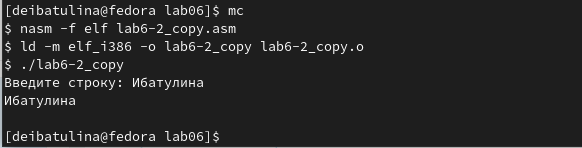{ #fig:018 width=70% }
  
# Выводы

  В процессе выполнениия лабораторной работы я приобрела практические навыки работы в Midnight Commander, а также освоила инструкции языка ассемблера mov и int.

# Список литературы{.unnumbered}

  1. Лабораторная работа №6. Руководство.

::: {#refs}
:::
