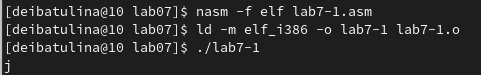

---
## Front matter
title: "Отчёт по лабораторной работе №7. Арифметические операци в Nasm"
subtitle: "дисциплина: Архитектура компьютера"
author: "Ибатулина Дарья Эдуардовна"

## Generic otions
lang: ru-RU
toc-title: "Содержание"

## Bibliography
bibliography: bib/cite.bib
csl: pandoc/csl/gost-r-7-0-5-2008-numeric.csl

## Pdf output format
toc: true # Table of contents
toc-depth: 2
lof: true # List of figures
fontsize: 12pt
linestretch: 1.5
papersize: a4
documentclass: scrreprt
## I18n polyglossia
polyglossia-lang:
  name: russian
  options:
	- spelling=modern
	- babelshorthands=true
polyglossia-otherlangs:
  name: english
## I18n babel
babel-lang: russian
babel-otherlangs: english
## Fonts
mainfont: PT Serif
romanfont: PT Serif
sansfont: PT Sans
monofont: PT Mono
mainfontoptions: Ligatures=TeX
romanfontoptions: Ligatures=TeX
sansfontoptions: Ligatures=TeX,Scale=MatchLowercase
monofontoptions: Scale=MatchLowercase,Scale=0.9
## Biblatex
biblatex: true
biblio-style: "gost-numeric"
biblatexoptions:
  - parentracker=true
  - backend=biber
  - hyperref=auto
  - language=auto
  - autolang=other*
  - citestyle=gost-numeric
## Pandoc-crossref LaTeX customization
figureTitle: "Рис."
listingTitle: "Листинг"
lofTitle: "Список иллюстраций"
lolTitle: "Листинги"
## Misc options
indent: true
header-includes:
  - \usepackage{indentfirst}
  - \usepackage{float} # keep figures where there are in the text
  - \floatplacement{figure}{H} # keep figures where there are in the text
---

# Цель работы

  Освоение арифметических инструкций языка ассемблера NASM.

# Задание

  1. Написание программ вывода символьных и численных значений;
  2. Написание программ вычисления значений арифметичсеких выражений;
  3. Выполнение заданий для самостоятельной работы. 

# Теоретическое введение

## Адресация в Nasm

  Большинство инструкций на языке ассемблера требуют обработки операндов. Адрес операнда предоставляет место, где хранятся данные, подлежащие обработке. Это могут быть данные хранящиеся в регистре или в ячейке памяти. Далее рассмотрены все существующие способы задания адреса хранения операндов – способы адресации.
  
  Существует три основных способа адресации:
  
  * **Регистровая адресация** – операнды хранятся в регистрах и в команде
используются имена этих регистров, например: mov ax,bx.

  * **Непосредственная адресация** – значение операнда задается непосредственно в команде, Например: mov ax,2.
  
  * **Адресация памяти** – операнд задает адрес в памяти. В команде указывается символическое обозначение ячейки памяти, над содержимым которой
требуется выполнить операцию.

  Например, определим переменную intg DD 3 – это означает, что задается область памяти размером 4 байта, адрес которой обозначен меткой intg. В таком случае, команда
  
```language:assembler 
mov eax,[intg]

```
копирует из памяти по адресу intg данные в регистр eax. 

  В свою очередь, команда

```language:assembler
mov [intg],eax

```

запишет в память по адресу intg данные из регистра eax.

  Также рассмотрим команду

```language:assembler
mov eax,intg

```

  В этом случае в регистр *eax* запишется адрес *intg*. Допустим, для *intg* выделена память начиная с ячейки с адресом 0x600144, тогда команда *mov eax,intg* аналогична команде *mov eax,0x600144* – т.е. эта команда запишет в регистр eax число 0x600144.
  
## Арифметические операции в NASM

### Целочисленное сложение add

  Схема команды целочисленного сложения add (от англ. addition - добавление) выполняет сложение двух операндов и записывает результат по адресу первого операнда. Команда add работает как с числами со знаком, так и без знака и выглядит следующим образом:

```language:assembler
add <операнд_1>, <операнд_2>

```

### Целочисленное вычитание sub

  Команда целочисленного вычитания sub (от англ. subtraction – вычитание) работает аналогично команде add и выглядит следующим образом:

```language:assembler
sub <операнд_1>, <операнд_2>

```
### Команды инкремента и декремента.
  Довольно часто при написании программ встречается операция прибавления или вычитания единицы. Прибавление единицы называется инкрементом, а вычитание — декрементом. Для этих операций существуют специальные команды: *inc* (от англ. *increment*) и *dec* (от англ. *decrement*), которые увеличивают и уменьшают на 1 свой операнд.
  
  Эти команды содержат один операнд и имеет следующий вид:
```language:assembler
inc <операнд>
dec <операнд>

```
### Команда изменения знака операнда neg

  Еще одна команда, которую можно отнести к арифметическим командам, это команда изменения знака neg:

```language:assembler
neg <операнд>

```

### Команды умножения mul и imul

  Умножение и деление, в отличии от сложения и вычитания, для знаковых и беззнаковых чисел производиться по-разному, поэтому существуют различные команды.
  
  Для беззнакового умножения используется команда mul (от англ. *multiply* – умножение):
  
```language:assembler
mul <операнд>

```

  Для знакового умножения используется команда imul:

```language:assembler
imul <операнд>

```
### Команды деления div и idiv

  Для деления, как и для умножения, существует 2 команды *div* (от англ. *divide* - деление) и *idiv*:

```language:assembler
div <делитель> ; Беззнаковое деление
idiv <делитель> ; Знаковое деление

```

  В командах указывается только один операнд – делитель, который может быть регистром или ячейкой памяти, но не может быть непосредственным операндом.
  
## Перевод символа числа в десятичную символьную запись

  Ввод информации с клавиатуры и вывод её на экран осуществляется в символьном виде. Кодирование этой информации производится согласно кодовой таблице символов ASCII. ASCII – сокращение от American Standard Code for Information Interchange (Американский стандартный код для обмена информацией). Согласно стандарту ASCII каждый символ кодируется одним байтом.
  
  Среди инструкций NASM нет такой, которая выводит числа (не в символьном виде). Поэтому, например, чтобы вывести число, надо предварительно преобразовать его цифры в ASCII-коды этих цифр и выводить на экран эти коды, а не само число. Если же выводить число на экран непосредственно, то экран воспримет его не как число, а как последовательность ASCII-символов – каждый байт числа будет воспринят как один ASCII-символ – и выведет на экран эти символы.
  
  Аналогичная ситуация происходит и при вводе данных с клавиатуры. Введенные данные будут представлять собой символы, что сделает невозможным получение корректного результата при выполнении над ними арифметических
операций.

  Для выполнения лабораторных работ в файле in_out.asm реализованы подпрограммы для преобразования ASCII символов в числа и обратно. Это:
  
* *iprint* – вывод на экран чисел в формате ASCII, перед вызовом iprint в
регистр eax необходимо записать выводимое число (mov eax,<int>).

* *iprintLF* – работает аналогично iprint, но при выводе на экран после
числа добавляет к символ перевода строки.

* *atoi* – функция преобразует ascii-код символа в целое число и записает
результат в регистр eax, перед вызовом atoi в регистр eax необходимо
записать число (mov eax,<int>).

# Выполнение лабораторной работы

  1. Создаём каталог для программ лабораторной работы № 7, переходим в него и создаём файл lab7-1.asm (рис. [-@fig:001]):

{ #fig:001 width=70% }

  Скопируем внешний файл in_out.asm в наш каталог для лабораторной работы, поскольку он будет использоваться в дальнейших программах (рис. [-@fig:002]):

{ #fig:002 width=70% }

  2. Введём в файл lab7-1.asm текст программы из листинга (рис. [-@fig:003]), создадим исполняемый файл и запустим его (рис. [-@fig:004]):
  
{ #fig:003 width=70% }

{ #fig:004 width=70% }

  В данном случае при выводе значения регистра eax мы ожидаем увидеть число 10. Однако результатом будет символ j. Это происходит потому, что код символа 6 равен 00110110 в двоичном представлении (или 54 в десятичном представлении), а код символа 4 – 00110100 (52). Команда add eax,ebx запишет
в регистр eax сумму кодов – 01101010 (106), что в свою очередь является кодом символа j.

  3. Теперь изменим текст программы, заменив символы "6" и "4" на числа 6 и 4 (рис. [-@fig:005]). Создадим исполняемый файл и запустим его (рис. [-@fig:006]):
  
{ #fig:005 width=70% }

{ #fig:006 width=70% }

  Как и в предыдущем случае при исполнении программы мы не получим число 10. В данном случае выводится символ с кодом 10. В соответствии с таблицей, приложенной к руководству по лабораторной работе №7, это символ перевода строки. При выводе на экран он, как видно по скриншоту, не отображается.
  
  4. Создаём файл lab7-2.asm в каталоге ~/work/arch-pc/lab07 (рис. [-@fig:007]) и введите в него текст программы из листинга (рис. [-@fig:008]). Создаём исполняемый файл и запускаем его рис. ([-@fig:009]):
  
{ #fig:007 width=70% }

{ #fig:008 width=70% }

{ #fig:009 width=70% }

  В результате работы программы мы получим число 106. В данном случае, как и в первом, команда *add* складывает коды символов ‘6’ и ‘4’ (54+52=106). Однако, в отличии от предыдущей программы, функция *iprintLF* позволяет вывести число, а не символ, кодом которого является это число.

  5. Аналогично предыдущему примеру изменим символы на числа (рис. [-@fig:010]). Создадим исполняемый файл и запустим его рис. ([-@fig:011]):
 
{ #fig:010 width=70% }

{ #fig:011 width=70% }


  Заменим функцию iprintLF на iprint (рис. [-@fig:012]). Создаём исполняемый файл и запускаем его (рис. [-@fig:013]). Выводы функций iprintLF и iprint отличаются тем, что iprintlF делает перевод на новую строку, а iprint - нет.
  
{ #fig:012 width=70% }

{ #fig:013 width=70% }

  6. Создаём файл lab7-3.asm в каталоге ~/work/arch-pc/lab07 (рис. [-@fig:014]):
  
{ #fig:014 width=70% }

  Вводим в данный файл текст программы из листинга (рис. [-@fig:015]). Данная программа вычисляет значение арифметического выражения (5 * 2 + 3) / 3 (рис. [-@fig:016]):

{ #fig:015 width=70% }

{ #fig:016 width=70% }

  Вывод программы корректен.
  
  Теперь заменим некоторые числа в этой программе (рис. [-@fig:017]): так, теперь она будет вычислять значение выражения (4 * 6 + 2) / 5 (рис. [-@fig:018]):
  
{ #fig:017 width=70% }

{ #fig:018 width=70% }

  7. Создаём файл variant.asm в каталоге ~/work/arch-pc/lab07 (рис. [-@fig:019]):
  
{ #fig:019 width=70% }

  Ввожу в файл текст программы (рис. [-@fig:020]):
  
{ #fig:020 width=70% }

  Создаём исполняемый файл и, вычислив номер варианта аналитически, приходим к выводу, что программа вычислила номер варианта корректно (рис. [-@fig:021]):
  
{ #fig:021 width=70% }

## Ответы на вопросы

  1. За вывод на экран сообщения "Ваш вариант" отвечают следующие строки кода программы:
  
```language:assembler
  mov eax,rem
  call sprint
  
```

  2. Инструкция *mov ecx,x* используется для помещения адреса вводимого значения x в регистр ecx. Инструкция *mov edx,80* предназначена для помещения длины вводимого с клавиатуры значения. Инструкция call sread относится ко внешнему файлу и позволяет прочитать введённое пользователем значение.
  
  3. Функция *atoi* преобразует ASCII-код символа в целое число и записает результат в регистр eax, перед вызовом atoi в регистр eax необходимо записать число (*mov eax,<int>*).
  
  4. За вычисление номера варианта отвечают следующие строки кода программы: 
  
```language:assembler
xor edx,edx ; обнуляем edx для корректной работы div
mov ebx,20 ; помещаем в регистр ebx число 20: ebx = 20
div ebx ; eax = eax / 20
inc edx ; edx = edx + 1

```
  
  5. При выполнении инструкции *div ebx* остаток от деления записывается в регистр *edx*.
  
  6. Инструкция *inc edx* увеличивает значение регистра *edx* на 1. Прибавление единицы называется инкрементом. 
  
  7. За вывод результата вычисления на экран отвечают следующие сроки кода программы:
  
```language:assembler
mov eax,edx
call iprintLF

```
## Выполнение заданий для самостоятельной работы

  1. В соответствии с номером моего варианта необходимо написать программу для вычисления значения арифметического выражения. Мой вариант №15, f(x) = (5 + x) ^ 2 - 3. Создаю файл для данной программы (рис. [-@fig:022], ввожу текст программы (рис. [-@fig:023], создаю и запускаю исполняемый файл, проверяю работу программы для заданных значений x: 5 и 1 (рис. [-@fig:024]):
  
{ #fig:022 width=70% }

{ #fig:023 width=70% }

{ #fig:024 width=70% }

  Приведу ниже листинг программы для вычисления значения арифметического выражения (5 + x) ^ 2 - 3:
  
  **Листинг программы для вычисления значения арифметического выражения (5 + x) ^ 2 - 3 (Вариант 15)**
  
```language:assembler
; --------------------------------------------------------------------------
; Программа для вычисления выражения (5 + x) ^ 2 - 3 и ввода х с клавиатуры
; --------------------------------------------------------------------------
 
%include 'in_out.asm' ; подключение внешнего файла
SECTION .data ; секция инициированных данных
msg: DB 'Выражение, для которого будет осуществляться подсчёт: (5 + x) ^ 2 - 3. 
         Введите значение переменной х: ',0
rem: DB 'Результат: ',0 ; помещение строк для вывода на экран по адресам msg и rem
SECTION .bss ; секция не инициированных данных
x: RESB 80 ; Переменная, которую пользователь будет вводить с клавиатуры
SECTION .text
GLOBAL _start ; Начало программы
_start: ; Точка входа в программу

; ---- Вычисление выражения

mov eax, msg ; запись адреса выводимиого сообщения в eax
call sprintLF ; вызов подпрограммы печати сообщения
mov ecx, x ; запись адреса переменной в ecx
mov edx, 80 ; запись длины вводимого значения в edx
call sread ; вызов подпрограммы ввода сообщения
mov eax,x ; вызов подпрограммы преобразовани
call atoi ; ASCII кода в число, `eax = x`
add eax,5; eax = eax + 5 = x + 5
mul eax ; возведение выражения (х + 5) в квадрат
add eax,-3 ; eax = eax - 3 = (x + 5) ^ 2 - 3
mov edi,eax ; запись результата вычисления в 'edi'

; ---- Вывод результата на экран

mov eax,rem ; вызов подпрограммы печати
call sprint ; сообщения 'Результат: '
mov eax,edi ; вызов подпрограммы печати значения
call iprintLF ; из 'edi' в виде символов
call quit ; вызов подпрограммы завершения

```

  Выполнив подсчёты аналитически, я пришла к выводу, что программа работает корректно.

# Выводы

  При выполнении лабораторной работы я освоила арифметические инструкции языка Ассемблер.

# Список литературы{.unnumbered}

  * Руководство по выполнению лабораторной работы №7.
  
::: {#refs}
:::
